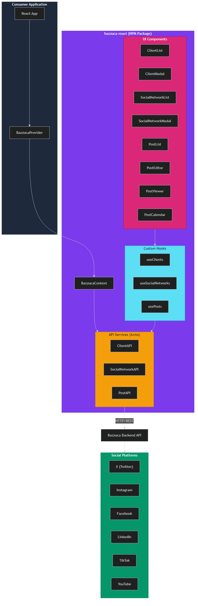

# bazzuca-react - React Components for Social Media Management


[](https://www.npmjs.com/package/bazzuca-react)
[](https://opensource.org/licenses/MIT)

## Overview

**bazzuca-react** is a React component library (NPM package) for the **Bazzuca** social media management system. It provides ready-to-use UI components, custom hooks, API services, and TypeScript types for managing clients, social networks, and posts across multiple platforms — including X (Twitter), Instagram, Facebook, LinkedIn, TikTok, YouTube, WhatsApp, SMS, and Email.

Built with **React 18**, **TypeScript**, **Tailwind CSS**, and **shadcn/ui** primitives. Published in dual format (ES modules + CommonJS).

---

## 🚀 Features

- 🎯 **Client Management** — Full CRUD for managing social media clients
- 🌐 **Social Network Integration** — Support for X, Instagram, Facebook, LinkedIn, TikTok, YouTube, WhatsApp, SMS, and Email
- 📅 **Post Scheduling** — Schedule and view posts with an interactive calendar
- 📊 **Post Management** — Create, edit, view, and publish posts across platforms
- 🎨 **Beautiful UI** — Built with shadcn/ui components and Tailwind CSS
- 📱 **Responsive Design** — Works seamlessly on mobile, tablet, and desktop
- 🔒 **Type-Safe** — Full TypeScript support with exported types, enums, and type guards
- ⚡ **Performance** — Optimized with React hooks and efficient state management
- 📦 **Dual Format** — Ships as both ES module and CommonJS
- 🛡️ **Validation Utilities** — CPF, CNPJ, email, phone validators included

---

## 🛠️ Technologies Used

### Core Framework
- **React 18** — UI framework (peer dependency)
- **TypeScript 5.8** — Type-safe development
- **Vite 5** — Build tool in library mode

### Styling
- **Tailwind CSS 3.4** — Utility-first CSS with dark mode support
- **class-variance-authority** — Component variant management
- **Radix UI** — Accessible primitives (Dialog, Select, Tabs, Avatar, etc.)
- **Lucide React** — Icon library

### Data & Forms
- **Axios** — HTTP client for API communication
- **React Hook Form + Zod** — Form handling and schema validation
- **date-fns** — Date manipulation

### Content
- **react-markdown** — Markdown rendering
- **highlight.js** — Code syntax highlighting

### Testing
- **Vitest** — Test runner (jsdom environment)
- **Testing Library** — React component testing

### DevOps
- **GitHub Actions** — CI/CD for versioning, releases, and NPM publishing
- **GitVersion** — Semantic versioning automation

---

## 📁 Project Structure

```
bazzuca-react/
├── src/
│   ├── components/              # UI components
│   │   ├── ClientList.tsx       # Client management table
│   │   ├── ClientModal.tsx      # Client create/edit modal
│   │   ├── ConfirmDialog.tsx    # Confirmation dialog
│   │   ├── PostCalendar.tsx     # Calendar view for posts
│   │   ├── PostEditor.tsx       # Post create/edit form
│   │   ├── PostList.tsx         # Post management table
│   │   ├── PostViewer.tsx       # Post detail viewer
│   │   ├── SocialNetworkList.tsx    # Social network management
│   │   ├── SocialNetworkModal.tsx   # Social network create/edit
│   │   └── ui/                  # shadcn/ui primitives
│   │       ├── avatar.tsx
│   │       ├── button.tsx
│   │       ├── card.tsx
│   │       ├── input.tsx
│   │       ├── label.tsx
│   │       └── table.tsx
│   ├── contexts/
│   │   └── BazzucaContext.tsx    # Provider & dependency injection
│   ├── hooks/
│   │   ├── useClients.ts        # Client CRUD hook
│   │   ├── usePosts.ts          # Post CRUD hook
│   │   └── useSocialNetworks.ts # Social network CRUD hook
│   ├── services/
│   │   ├── client-api.ts        # Client API wrapper
│   │   ├── post-api.ts          # Post API wrapper
│   │   └── social-network-api.ts # Social network API wrapper
│   ├── styles/
│   │   └── index.css            # Tailwind CSS + theme variables
│   ├── types/
│   │   └── bazzuca.ts           # All interfaces, enums & type guards
│   ├── utils/
│   │   ├── cn.ts                # Classname merge utility
│   │   └── validators.ts        # CPF, CNPJ, email, phone validators
│   └── index.ts                 # Public API entry point
├── example-app/                 # Full working demo application
├── .github/workflows/           # CI/CD pipelines
├── docs/                        # Documentation & diagrams
├── tailwind.config.js
├── vite.config.ts
├── vitest.config.ts
├── tsconfig.json
├── GitVersion.yml
└── package.json
```

### Ecosystem

| Project | Type | Description |
|---------|------|-------------|
| **[bazzuca-react](https://github.com/landim32/Bazzuca/tree/main/bazzuca-react)** | NPM Package | React component library (this package) |
| **Bazzuca Backend API** | REST API | Backend service for social media management |
| **[nauth-react](https://www.npmjs.com/package/nauth-react)** | NPM Package | Authentication library used in the example app |

---

## 🏗️ System Design

The following diagram illustrates the high-level architecture of **bazzuca-react**:



The library follows a **layered architecture**: UI Components consume Custom Hooks, which in turn call API Services (Axios-based). The `BazzucaProvider` context wires everything together and provides dependency injection. Consumer applications wrap their React tree with the provider and use components/hooks directly.

> 📄 **Source:** The editable Mermaid source is available at [`docs/system-design.mmd`](docs/system-design.mmd).

---

## 📦 Installation

```bash
npm install bazzuca-react
# or
yarn add bazzuca-react
# or
pnpm add bazzuca-react
```

### Peer Dependencies

Ensure you have these peer dependencies installed:

```bash
npm install react react-dom react-router-dom
```

---

## ⚙️ Quick Start

### 1. Setup Provider

Wrap your app with the `BazzucaProvider`:

```tsx
import { BazzucaProvider } from 'bazzuca-react';
import 'bazzuca-react/styles';

function App() {
  return (
    <BazzucaProvider
      config={{
        apiUrl: 'https://api.yourdomain.com',
        timeout: 30000,
        headers: {
          Authorization: `Bearer ${yourToken}`,
        },
        onError: (error) => {
          console.error('API Error:', error);
        },
      }}
    >
      <YourApp />
    </BazzucaProvider>
  );
}
```

### 2. Use Components

```tsx
import { ClientList, ClientModal, PostCalendar } from 'bazzuca-react';
import { useState } from 'react';

function Dashboard() {
  const [isModalOpen, setIsModalOpen] = useState(false);

  return (
    <div>
      <ClientList
        onEdit={(client) => console.log('Edit', client)}
        onCreate={() => setIsModalOpen(true)}
      />

      <ClientModal
        isOpen={isModalOpen}
        onClose={() => setIsModalOpen(false)}
        onSave={(client) => console.log('Saved', client)}
      />

      <PostCalendar
        month={12}
        year={2024}
        onPostClick={(post) => console.log('Post clicked', post)}
      />
    </div>
  );
}
```

---

## 📖 Components

### Client Components

#### ClientList

Display and manage clients.

```tsx
<ClientList
  onEdit={(client) => handleEdit(client)}
  onDelete={(clientId) => handleDelete(clientId)}
  onCreate={() => setModalOpen(true)}
  showCreateButton={true}
  className="my-4"
/>
```

**Props:**
- `onEdit?: (client: ClientInfo) => void` — Callback when edit is clicked
- `onDelete?: (clientId: number) => void` — Callback when delete is clicked
- `onCreate?: () => void` — Callback when create button is clicked
- `showCreateButton?: boolean` — Show/hide create button (default: true)
- `className?: string` — Additional CSS classes

#### ClientModal

Create or edit a client.

```tsx
<ClientModal
  isOpen={isOpen}
  onClose={() => setIsOpen(false)}
  client={selectedClient} // undefined for new client
  onSave={(client) => handleSave(client)}
/>
```

**Props:**
- `isOpen: boolean` — Control modal visibility
- `onClose: () => void` — Callback when modal closes
- `client?: ClientInfo` — Client to edit (undefined for new)
- `onSave?: (client: ClientInfo) => void` — Callback when saved

### Social Network Components

#### SocialNetworkList

Display and manage social networks for a client.

```tsx
<SocialNetworkList
  clientId={selectedClientId}
  onEdit={(network) => handleEdit(network)}
  onDelete={(networkId) => handleDelete(networkId)}
  onCreate={() => setModalOpen(true)}
/>
```

#### SocialNetworkModal

Add or edit a social network.

```tsx
<SocialNetworkModal
  isOpen={isOpen}
  onClose={() => setIsOpen(false)}
  clientId={clientId}
  network={selectedNetwork}
  onSave={(network) => handleSave(network)}
/>
```

### Post Components

#### PostList

Display posts in a table view.

```tsx
<PostList
  month={12}
  year={2024}
  clientId={selectedClientId}
  onEdit={(post) => handleEdit(post)}
  onPublish={(postId) => handlePublish(postId)}
  onView={(post) => handleView(post)}
/>
```

#### PostEditor

Create or edit a post.

```tsx
<PostEditor
  postId={postId} // undefined for new post
  initialData={{ clientId: 1, title: 'Draft post' }}
  onSave={(post) => handleSave(post)}
  onCancel={() => handleCancel()}
/>
```

#### PostViewer

View post details.

```tsx
<PostViewer
  postId={postId}
  onEdit={(post) => handleEdit(post)}
  onPublish={(postId) => handlePublish(postId)}
  onBack={() => goBack()}
/>
```

#### PostCalendar

Calendar view of scheduled posts.

```tsx
<PostCalendar
  month={12}
  year={2024}
  clientId={clientId}
  onPostClick={(post) => handlePostClick(post)}
/>
```

---

## 🪝 Custom Hooks

### useClients

Manage clients with CRUD operations.

```tsx
import { useClients } from 'bazzuca-react';

function MyComponent() {
  const {
    clients,
    loading,
    error,
    createClient,
    updateClient,
    deleteClient,
    refreshClients,
  } = useClients();
}
```

### useSocialNetworks

Manage social networks for a client.

```tsx
import { useSocialNetworks } from 'bazzuca-react';

function MyComponent({ clientId }) {
  const {
    networks,
    loading,
    error,
    createNetwork,
    updateNetwork,
    deleteNetwork,
  } = useSocialNetworks(clientId);
}
```

### usePosts

Manage posts.

```tsx
import { usePosts } from 'bazzuca-react';

function MyComponent() {
  const {
    posts,
    loading,
    error,
    fetchPosts,
    createPost,
    updatePost,
    publishPost,
  } = usePosts(12, 2024); // month, year
}
```

---

## 🔌 API Services

Direct API access for advanced use cases:

```tsx
import { useBazzuca } from 'bazzuca-react';

function MyComponent() {
  const { clientApi, socialNetworkApi, postApi } = useBazzuca();

  // Direct API calls
  const clients = await clientApi.listClients();
  const networks = await socialNetworkApi.listByClient(clientId);
  const posts = await postApi.listPostsByUser(month, year);
}
```

---

## 📝 Type Definitions

### Core Types

```typescript
interface ClientInfo {
  clientId: number;
  userId: number;
  name: string;
  socialNetworks: SocialNetworkEnum[];
}

interface SocialNetworkInfo {
  networkId: number;
  clientId: number;
  network: SocialNetworkEnum;
  url: string;
  user: string;
  password: string;
}

interface PostInfo {
  postId: number;
  networkId: number;
  clientId: number;
  scheduleDate: string;
  postType: PostTypeEnum;
  mediaUrl: string;
  title: string;
  status: PostStatusEnum;
  description: string;
  socialNetwork?: SocialNetworkInfo;
  client?: ClientInfo;
}
```

### Enums

```typescript
enum SocialNetworkEnum {
  X = 1, Instagram = 2, Facebook = 3, LinkedIn = 4,
  TikTok = 5, YouTube = 6, WhatsApp = 7, SMS = 8, Email = 9,
}

enum PostTypeEnum { Post = 1, Story = 2, Reel = 3 }

enum PostStatusEnum {
  Draft = 1, Scheduled = 2, ScheduledOnNetwork = 3,
  Posted = 4, Canceled = 5,
}
```

### Configuration

```typescript
interface BazzucaConfig {
  apiUrl: string;              // Base API URL
  apiClient?: AxiosInstance;   // Optional custom Axios instance
  timeout?: number;            // Request timeout (default: 30000ms)
  headers?: Record<string, string>; // Custom headers (e.g., Authorization)
  onError?: (error: Error) => void; // Global error handler
}
```

---

## 🎨 Styling

The package includes Tailwind CSS styles. Import them in your app:

```tsx
import 'bazzuca-react/styles';
```

Make sure your Tailwind config includes the package:

```js
// tailwind.config.js
module.exports = {
  content: [
    './src/**/*.{js,jsx,ts,tsx}',
    './node_modules/bazzuca-react/**/*.{js,jsx,ts,tsx}',
  ],
  // ... rest of config
};
```

### Theming

The library uses HSL CSS variables for theming with class-based dark mode. Brand colors:

| Color | Hex | Usage |
|-------|-----|-------|
| Primary | `#7C3AED` | Main brand color |
| Secondary | `#DB2777` | Secondary accent |
| Accent | `#5cdef5` | Highlights |

---

## 🔧 Development Setup

### Prerequisites
- **Node.js** >= 18
- **npm** >= 9

### Setup Steps

#### 1. Clone and install

```bash
git clone https://github.com/landim32/Bazzuca.git
cd Bazzuca/bazzuca-react
npm install
```

#### 2. Development server

```bash
npm run dev
```

#### 3. Build

```bash
npm run build
```

#### 4. Lint

```bash
npm run lint
```

#### 5. Type check

```bash
npm run type-check
```

---

## 🧪 Testing

### Running Tests

**All Tests:**
```bash
npm run test
```

**Watch Mode:**
```bash
npm run test:watch
```

**With Coverage:**
```bash
npm run test:coverage
```

---

## 🔄 CI/CD

### GitHub Actions

The project uses three automated workflows:

| Workflow | Trigger | Description |
|----------|---------|-------------|
| **Version and Tag** | Push to `main` | Uses GitVersion to calculate semantic version and creates a git tag |
| **Publish to NPM** | After Version and Tag completes | Builds the package and publishes to NPM registry |
| **Create Release** | After Version and Tag completes | Creates a GitHub Release for minor/major version bumps |

**Pipeline flow:**
```
Push to main → Version and Tag → Publish to NPM
                               → Create Release (minor/major only)
```

---

## 📱 Example Application

The `example-app/` directory contains a full working demo showing:

- `BazzucaProvider` setup with configuration
- Routing with protected routes
- Integration with `nauth-react` for authentication
- Client, social network, and post management pages
- Calendar view for post scheduling

To run the example app:

```bash
cd example-app
cp .env.example .env
# Edit .env with your API URLs
npm install
npm run dev
```

---

## 🔒 Advanced Usage

### Custom Error Handling

```tsx
<BazzucaProvider
  config={{
    apiUrl: API_URL,
    onError: (error) => {
      toast.error(error.message);
      logErrorToService(error);
    },
  }}
>
  {children}
</BazzucaProvider>
```

### Context Access

```tsx
import { useBazzuca } from 'bazzuca-react';

function MyComponent() {
  const {
    config,
    isLoading,
    error,
    setError,
    selectedClient,
    setSelectedClient,
  } = useBazzuca();
}
```

### Authentication

Pass authentication tokens via headers:

```tsx
<BazzucaProvider
  config={{
    apiUrl: 'https://api.yourdomain.com',
    headers: {
      Authorization: `Bearer ${token}`,
    },
  }}
>
  {children}
</BazzucaProvider>
```

---

## 🌐 Browser Support

- Chrome (latest)
- Firefox (latest)
- Safari (latest)
- Edge (latest)

---

## 🤝 Contributing

Contributions are welcome! Please feel free to submit a Pull Request.

### Development Setup

1. Fork the repository
2. Create a feature branch (`git checkout -b feature/AmazingFeature`)
3. Make your changes
4. Run tests (`npm run test`)
5. Run lint (`npm run lint`)
6. Commit your changes (`git commit -m 'Add some AmazingFeature'`)
7. Push to the branch (`git push origin feature/AmazingFeature`)
8. Open a Pull Request

### Coding Standards

- TypeScript strict mode
- ESLint with zero warnings policy
- Tailwind CSS for styling (no inline styles)
- Components follow shadcn/ui patterns

---

## 👨‍💻 Author

Developed by **[Rodrigo Landim](https://github.com/landim32)**

---

## 📄 License

This project is licensed under the **MIT License** — see the [LICENSE](LICENSE) file for details.

---

## 🙏 Acknowledgments

- Built with [React](https://react.dev)
- Styled with [Tailwind CSS](https://tailwindcss.com)
- UI primitives by [Radix UI](https://www.radix-ui.com)
- Icons by [Lucide](https://lucide.dev)
- Component patterns from [shadcn/ui](https://ui.shadcn.com)

---

## 📞 Support

- **Issues**: [GitHub Issues](https://github.com/landim32/Bazzuca/issues)

---

**⭐ If you find this project useful, please consider giving it a star!**
